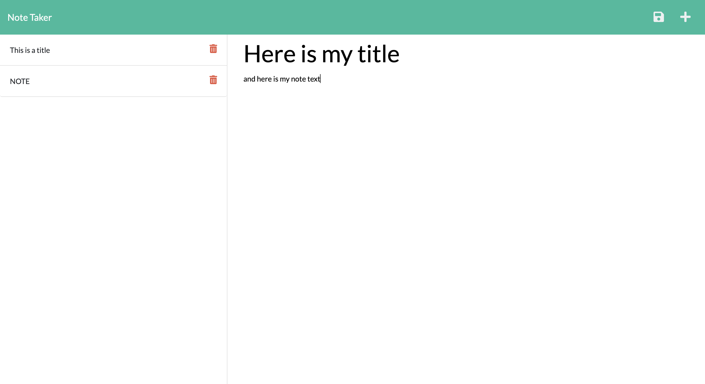

# Note Taker

  
  ## Table of Contents
  * [Description](#description)
  * [Technologies used](#technologies-used)
  * [Installation](#installation)
  * [How to Use](#How-to-use)
  * [Github] (#github-link)
  * [Heroku] (#heroku-link)
    
  ## Description
  This is a note taking application where users can add notes with a title and text, reselect and update notes, or even delete notes

  ## Technologies used
  * HTML
  * CSS
  * JS
  * Nodejs
  * Expressjs
  * Heroku

  ## Installation
  After pulling the files from this github repo, use the command line to navigate to where you saved the repo. Once there, run `npm install` to install our dependencies. After those have been installed, use the command `npm start` or `node server.js` to run the application.

  ## Use
  After clicking the 'Get Started' button, users can enter the note title and the note text and save that note using the save icon in the upper right corner. Clicking on a saved note from the list on the left will display it, along with the note text, and the option to update that note. To delete a note, simply click on the trash icon next to the note in the list on the left side.

  ## GitHub Link

  https://github.com/simmonsW/note-taker

  ## Heroku Link

  https://quiet-sea-27843.herokuapp.com/notes
  
  
